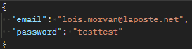
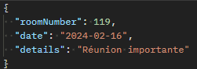

# Plateforme de réservation de salles de conférence

## Services

- Service d’authentification : Firebase
- Service d’envoi d'e-mails : MailGun
- Service de base de données : MongoDB Atlas

## Routes

- /register → Permet la création d’un compte dans Firebase
- /login → Permet la connexion à un compte existant dans Firebase
- /reservation → Permet la réservation d'une salle de conférence

## Fonctionnement

L'utilisateur peut créer un compte via la route /register ou se connecter via la route /login. Ensuite, en utilisant le jeton d'authentification de l'utilisateur, il est possible de réserver une salle de conférence via la route /reservation. Cette dernière vérifie dans la base de données si la salle est disponible pour la date donnée. Si la salle est disponible, une notification par e-mail est envoyée et la réservation est enregistrée dans la base de données. Sinon, un message d'erreur informe l'utilisateur que la salle n'est pas disponible pour la date donnée.

## Corps de la requête

Pour l'inscription, une adresse e-mail valide ainsi qu'un mot de passe d'au moins 8 caractères sont nécessaires.

Pour la connexion, les mêmes critères que pour l'inscription s'appliquent.

Pour effectuer une réservation, les informations suivantes sont requises :

- Numéro de salle (compris entre 1 et 300)
- Date (au format "YYYY-MM-DD")
- Détails (pour spécifier la raison de la réservation)

  
